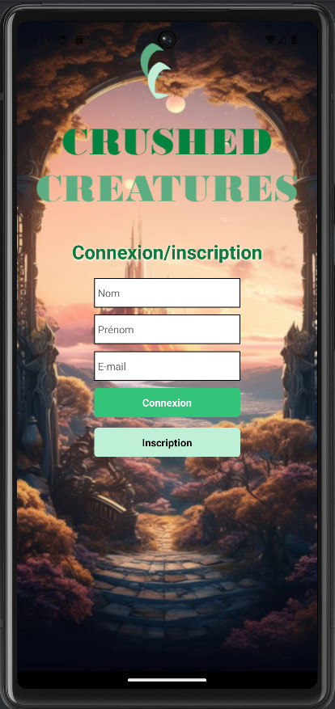
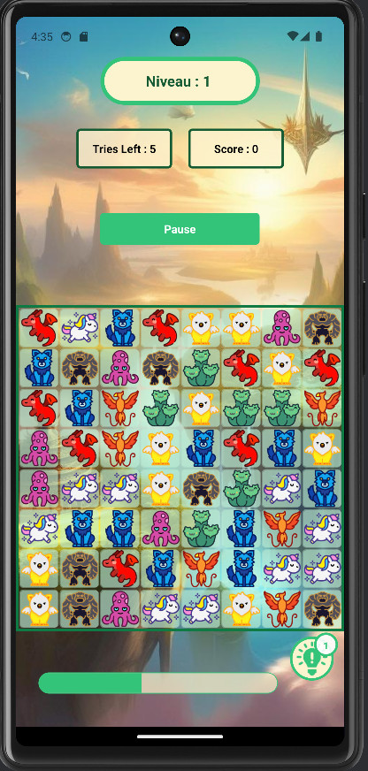
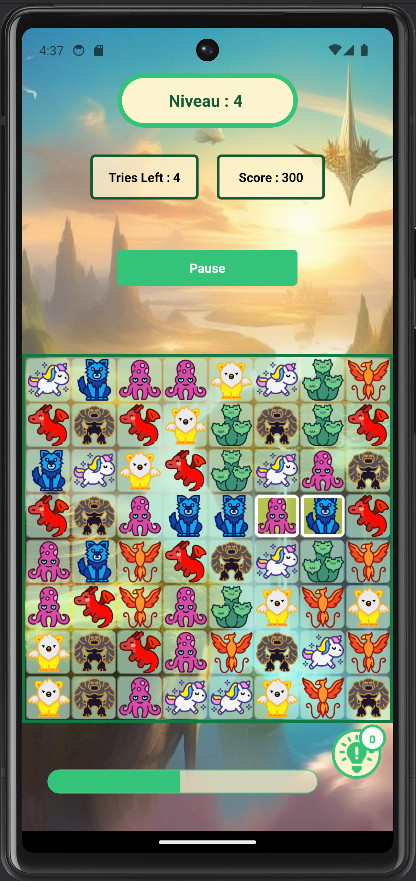
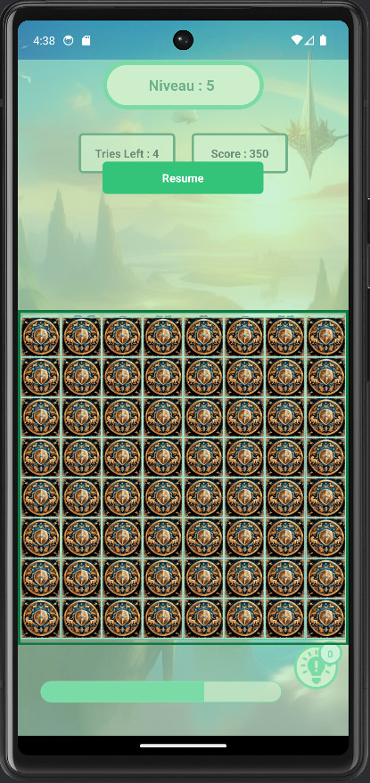
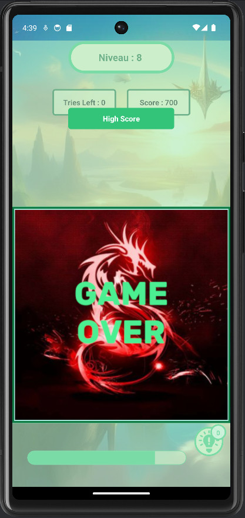
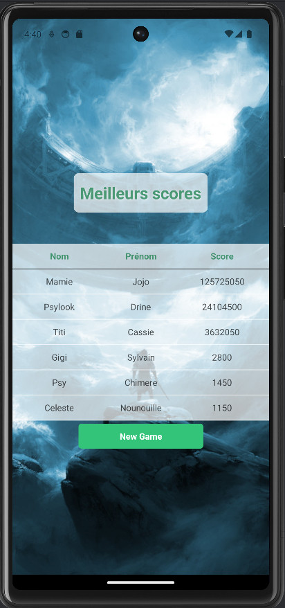

# Bejeweled Psylook : Crushed Creatures

Un projet réalisé pour le cours de React Native.

<strong>Délais :</strong> environ 2 mois et demi.

## Langages utilisés
- Javascript avec React Native
- PHP en api

## Réalisations demandées
- Une application mobile
- Un jeu de type bejeweled
- Connexion/Inscription de l'utilisateur
- Un grille de 8x8
- 8 images générées aléatoirement
- Déplacement d'images adjacentes
- Alignement d'images x3, x4, x5
- Gestion du score en fonction du nombre d'images alignées (50 x Niveau pour 3, 150 x Niveau pour 4, 500 x Niveau pour 5)
- Suppression des images alignées, décalage des cellules vers le bas
- Barre de progression : -1% toutes les 3 secondes, augmente en fonction du score
- Essai : 5 essais, décrémentation de 1 si la permutation est un échec
- Hint (aide qui trouve les opérations de permutation)
- Pause : grille masquée, arrêt et reprise de la progressBar
- Game Over : lorsque la barre de progression ou le nombre d'essais arrive à 0
- Sauvegarde en base de données (comptes et scores)

## Réalisations supplémentaires
- Utilisation du reducer
- Affichage des six meilleurs scores
- Changement d'apparence des images sélectionnées
- Effet de permutation lorsque les images sont échangées

<h2 style="text-align: center;">Images du jeu</h2>

<h4 style="text-align: center;">Accueil de l'application : Connexion/Inscription</h4>

 

<h4 style="text-align: center;">Grille de jeu :</h4>

 
 

<h4 style="text-align: center;">Pause du jeu :</h4>

 

<h4 style="text-align: center;">Game Over et affichage des meilleurs scores :</h4>

 
 